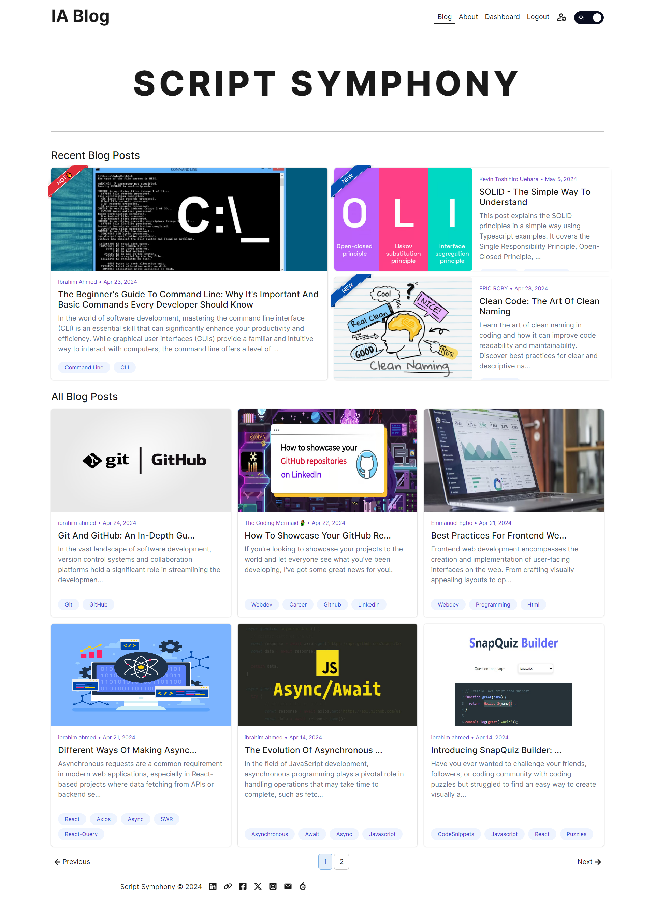

# Script Symphony - Coding Blog Site

Script Symphony is a coding blog site where users can write, manage, and publish blog articles. It fetches data from a backend server, allowing users to perform various actions such as creating, updating, and deleting articles. Articles are written in Markdown format and can include metadata such as title, author name, description, tags, cover image, and content.

## Table of Contents

1. [Folder Structure](#folder-structure)
2. [Features](#features)
3. [Technologies Used](#technologies-used)
4. [Setup](#setup)
5. [Environment Variables](#environment-variables)
6. [Available Scripts](#available-scripts)
7. [Usage](#usage)
8. [Notes](#notes)
9. [Contact](#contact)

## Folder Structure

```
├───.vscode
├───dist
│   └───assets
├───public
└───src
    ├───assets
    ├───components
    │   ├───aboutComponents
    │   ├───articleComponents
    │   ├───ArticleFormComponents
    │   ├───footer
    │   ├───header
    │   ├───homeComponents
    │   │   ├───allPosts
    │   │   ├───pagination
    │   │   └───recentPosts
    │   ├───navBar
    │   └───userFormComponents
    ├───context
    ├───features
    │   ├───article
    │   ├───articles
    │   └───user
    ├───hooks
    ├───pages
    ├───scss
    │   └───variables
    ├───utilities
    └───validation
```

## Features

- **Article Management:**

  - Create, edit, and delete blog articles.
  - Write articles using Markdown format.
  - Manage article metadata such as title, author, description, tags, and cover image.

- **Dashboard:**

  - View all articles with pagination.
  - Track the total number of articles and views.
  - Navigate between pages and sort articles by date or views.

- **Authentication:**

  - User authentication system to secure access to the dashboard.
  - Login/logout functionality with form validation.

- **Theme Switcher:**

  - Option to toggle between light and dark themes.
  - Enhances readability and user experience based on user preference.

- **Additional Features:**
  - API integration for fetching article data from the backend.
  - Markdown preview for real-time article editing.
  - Responsive design for optimal viewing across devices.

## Screenshot



## Technologies Used

- React
- Material-UI for UI components
- Redux Toolkit for state management
- React Router DOM for routing
- react-markdown for rendering Markdown content
- react-icons for icons
- react-toastify for notifications
- Axios for making HTTP requests
- vite for build.

## Setup

1. Clone the repository.

   ```bash
   git clone https://github.com/ibrahim11elian/My-Blog.git
   ```

2. Navigate into the project directory.

   ```bash
    cd My-Blog
   ```

3. Install dependencies using npm.

   Using npm:

   ```bash
   npm i
   ```

4. Start the development server.

   ```bash
   npm start
   ```

The application will be accessible at `http://localhost:5000`.

## Environment Variables

To run this project, you will need to add the following environment variables to your .env file. Make sure to replace the values with your own configuration:

```plaintext
VITE_API_URL={Your API URL}
```

This variable specifies the API URL used for fetching data from the backend server. You need to replace `{Your API URL}` with your API URL

**Note:** The Backend repository is currently under development and once it 's ready, I will provide a link here.

## Available Scripts

- **start:** Starts the development server.
- **build:** Builds the project for production.
- **lint:** Lints the code using ESLint.
- **preview:** Previews the production build locally.

## Usage

1. Login to access the dashboard(Admin only).
2. Create, update, or delete articles as needed.
3. Write articles using Markdown syntax.
4. Add metadata such as title, author name, description, tags, and cover image.
5. View article statistics on the dashboard.

## Notes

- Ensure proper authentication and authorization mechanisms are implemented to secure user data and prevent unauthorized access.
- Handle errors and edge cases gracefully to provide a smooth user experience.
- Follow best practices for writing clean, maintainable code and optimizing performance.
- Regularly update dependencies to leverage new features and security patches.

## Contact

 <p align="left">

<a href="https://www.linkedin.com/in/ibrahim-ahmed-a8bba9196" target="_blank">
</a>
<a href="https://www.facebook.com/ibrahim11ahmed" target="_blank">
</a>
<a href="mailto:ibrahim11elian@gmail.com" target="_blank">
</a>
<a href="tel:+201157676284" target="_blank">
</a>
<a href="https://www.instagram.com/ibrahim11ahmed/" target="_blank">
</a>
<a href="https://twitter.com/ibrahim11elian" target="_blank">
